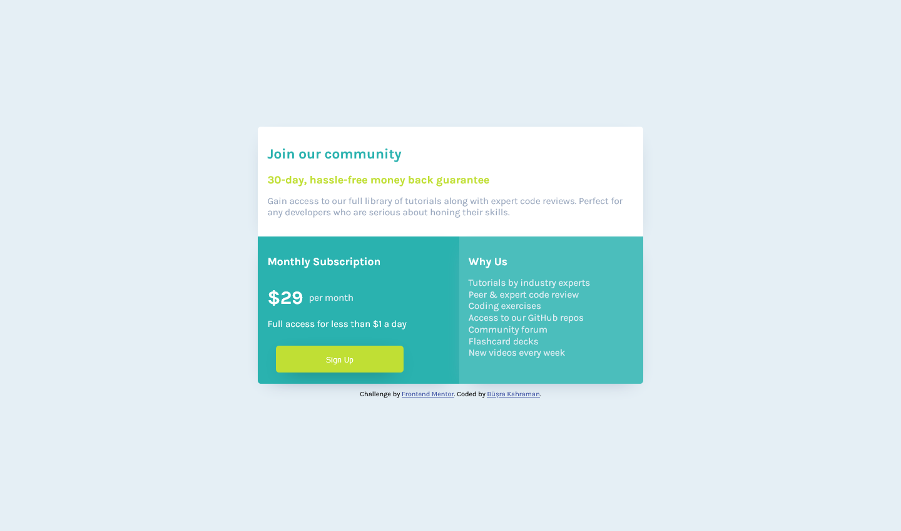

# Frontend Mentor - Single price grid component solution

This is a solution to the [Single price grid component challenge on Frontend Mentor](https://www.frontendmentor.io/challenges/single-price-grid-component-5ce41129d0ff452fec5abbbc).

## Table of contents

- [Overview](#overview)
  - [The challenge](#the-challenge)
  - [Screenshot](#screenshot)
- [My process](#my-process)
  - [Built with](#built-with)
  - [What I learned](#what-i-learned)
- [Author](#author)

## Overview

### The challenge

Users should be able to:

- View the optimal layout for the component depending on their device's screen size

### Screenshot

## My process

### Built with

- Semantic HTML5 markup
- CSS custom properties
- Flexbox
- CSS Grid
- Mobile-first workflow
- SASS

### What I learned

This was the first time I did my styling with mobile first approach and I found starting with smaller screens and adjusting the styling to bigger screens easier than other way around.

## Author

- Website - [Büşra Kahraman](https://busrakahraman.github.io/Portfolio/)
- Frontend Mentor - [@BusraKahraman](https://www.frontendmentor.io/profile/BusraKahraman)
